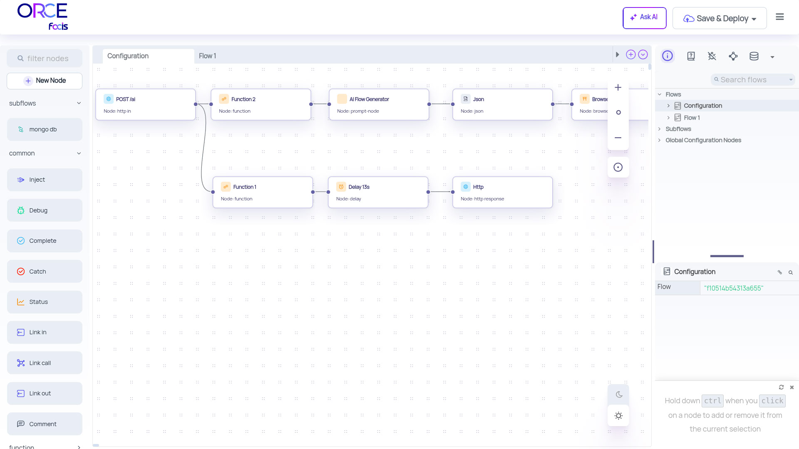

# XFSC Orchestration Engine - ORCE

An improved Low-code Orchestration engine for event-driven applications with added enhancements and features optimized for XFSC Toolbox.



# About

XFSC Orchestration Engine is a fork of the popular node-red project, with additional features aimed at improving application networking. The project takes the core functionality of node-red and extends it, making it easier to create complex networked applications and services. XFSC ORCE is designed to implement and configure onboarding and Accreditation workflows for the Gaia-X ecosystem and runs under Apache Version 2 license.

## Key Features

- Enhanced user interface for easier navigation/integration
- GUI Generator with JSON Data
- Expanded connectivity through the implementation of specialized nodes for external interactions
- Better integration with cloud services for seamless deployment
- Advanced application networking capabilities
- Improved performance and reliability

The XFSC Orchestration Engine is an ongoing development effort and some of its key features are still in progress. Keep checking our project page for updates and new releases.


## Easy Deployment

To deploy the XFSC-ORCE project using Docker, follow these simple steps:

### Prerequisites

1. Docker installed on your machine. See [Docker's official installation guide](https://docs.docker.com/get-docker/) for details.

### Deployment

2. **Pull the Docker Image**
   
   Pull the latest Docker image from Docker Hub:
   ```bash
   docker pull ecofacis/xfsc-orce:2.0.3

3. **Run the Container**
   
   Start your container using:
   ```bash
   docker run -d  -p 1880:1880 -p 8080:8080 ecofacis/xfsc-orce:2.0.3

4. **Verify Installation**
   
   After running the container, verify that it is working correctly:
   ```bash
   docker ps

5. **Launch URL**
		
	<http://localhost:1880>

   Upon initial setup, use the following credentials to access the system:
   ```bash
   Username: admin
   Password: xfsc-orce

## Setting Up and Running with npm

If you want to run the latest code from git, here's how to get started:

1. Clone the code:

        git clone https://github.com/eclipse-xfsc/orchestration-engine.git
        cd orchestration-engine/

2. Install the node-red dependencies

        npm install

3. Build the code

        npm run build

4. Run

        npm start
		
5. Launch URL
		
	<http://localhost:1880>


## Changelogs
For changelogs please visit [ORCE CHANGELOGS](ORCE+Node-RED-Changelog.md) and [Node-RED CHANGELOGS](CHANGELOG.md)


## Getting Help

Please note that the XFSC Orchestration Engine project will have continuous updates and improvements to its documentation.


## Copyright and license

XFSC Orchestration Engine is released under [the Apache 2.0 license](LICENSE).
