# GXUI: Gaia-X User Interface Generator

# A. Definition

GXUI, the Gaia-X User Interface Generator, is a comprehensive toolset designed for the creation, management, and customization of user interfaces within the Gaia-X ecosystem. By leveraging a low-code programming approach, GXUI enables users to build and deploy UIs with ease, without the need for extensive coding knowledge.

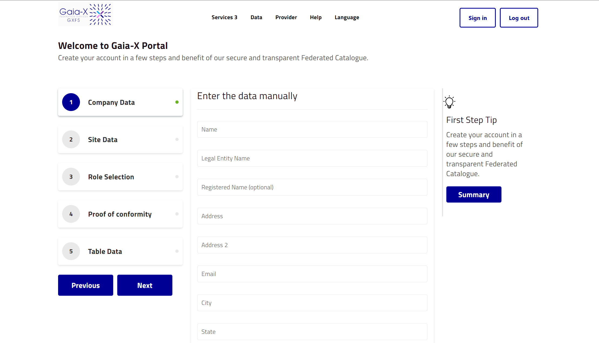

## A.1 Key Features

- **Intuitive UI Creation**: GXUI simplifies the user interface creation process through a powerful drag-and-drop Orchestration Engine, allowing users to design forms, wizards, and more with minimal effort.
- **Seamless Integration**: GXUI is designed to work in harmony with the [Gaia-X Orchestration Engine (ORCE)](https://gitlab.eclipse.org/eclipse/xfsc/oaw), enabling the seamless exchange of data between user interfaces and other components within the Gaia-X federation services.
- **Customization**: Users can tailor their UIs to their specific needs, defining custom styles and functionality for data retrieval from forms for subsequent use in Gaia-X workflows.
- **JSON-based Data Handling**: GXUI employs JSON data sets for the creation of forms and fields, as well as the transmission of data between the front-end and back-end components of the system, ensuring a consistent and efficient data exchange process.

With GXUI, creating professional, functional, and visually appealing user interfaces for the Gaia-X ecosystem has never been easier or more accessible.

# B. Introduction
This guide will walk you through the process of creating a custom form using our GXUI nodes in GitLab. These nodes allow you to design forms with headers, footers, and various input elements, such as checkboxes, radio buttons, switch buttons, and more. By following the steps outlined below, you'll learn how to create a form from scratch and customize it according to your preferences.

Our GXUI custom nodes consist of four main nodes that allow you to create comprehensive and customizable forms:

- **Data Set**: This node is responsible for creating the form body, which includes various input elements such as checkboxes, radio buttons, menu buttons, and more.
- **Header**: The Header node allows you to design and customize the form header, providing essential information and navigation options for users.
- **Footer**: With the Footer node, you can create a tailored form footer, which typically includes additional navigation, contact information, or disclaimers.
- **Label**: Lastly, the Label node enables you to add a title and description for your form, helping users understand its purpose and instructions.

## C. Prerequisites

Before getting started, ensure that you have the following prerequisites in place:

### C.1 Development Pre-Requisites

**C.1.1 Step One** :

Install npm, git, and Node.js:

- **npm**: Visit the [npm website](https://www.npmjs.com/get-npm) and follow the installation instructions for your operating system.
- **git**: Visit the [git website](https://git-scm.com/downloads) and follow the installation instructions for your operating system.
- **Node.js**: Visit the [Node.js website](https://nodejs.org/en/download/) and follow the installation instructions for your operating system.

**C.1.2 Step Two** :

Install "npm-pack-all" with command.using the following command:

      npm install -g npm-pack-all

### C.2 Engine Pre-Requisites
**C.2.1 Step One** :
Install and run the Gaia-X Orchestration Engine by following the instructions in the linked repository.

**C.2.2 Step Two** :
Install node-red-contrib-uibuilder:

      npm install -g node-red-contrib-uibuilder

After installing the UI Builder node, you should install the required libraries into it. These are the libraries you need:

1. bootstrap
2. bootstrap-vue
3. http-vue-loader
4. vue
5. vue-router

**C.2.2 Step Three** :
Install the [GXUI Cross OS Framework](https://gitlab.com/gaia-x/data-infrastructure-federation-services/GXFS_OAW/nodes/gxui-cross-os-framework) by following the instructions in the linked repository.

**C.2.3 Step Four** :
Install the [GXUI Simple Navigation](https://gitlab.com/gaia-x/data-infrastructure-federation-services/GXFS_OAW/nodes/gxui-navigation) for creating simple navigation between forms by following the instructions in the linked repository.

### C.3 Optional Pre-Requisites

**GXUI Persistence Layer** : Install the GXUI Persistence Layer for permanently storing data (refer to the corresponding repository for installation instructions).

# D. Installation

Follow these steps to clone the repository from GitLab and install the package globally on your device using npm.

### D.1 Method one : npm install

**D.1.1 Step one Clone the Repository**

Open your terminal or command prompt and navigate to the directory where you want to clone the project. Run the following command to clone the repository:

     git clone https://gitlab.eclipse.org/eclipse/xfsc/oaw.git

**D.1.2 Step Two Navigate to the Project Directory**

After cloning the repository, navigate to the project directory:

     cd gxui\src

**D.1.3 Step Three Install the Package Globally**

To install the package globally on your device, run the following command:

    npm install -g

This command installs the package and makes it available for use anywhere on your device.

### D.2 Method two :  Install from Node-RED Manage Palette

**D.2.1.** Open your Node-RED editor in your web browser.

**D.2.2.** Click on the hamburger menu in the top-right corner and choose "Manage Palette".

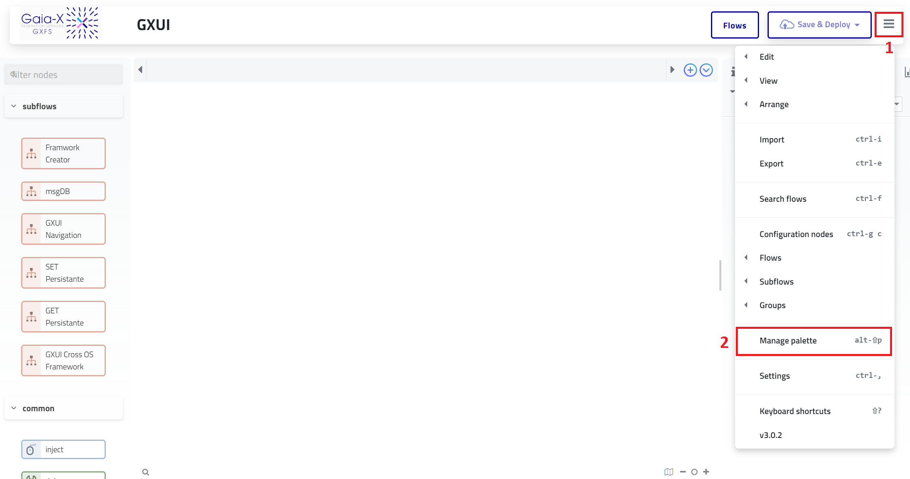

**D.2.3.** In the "Manage Palette" window, click on the "Install" tab. Then  on the upload icon.

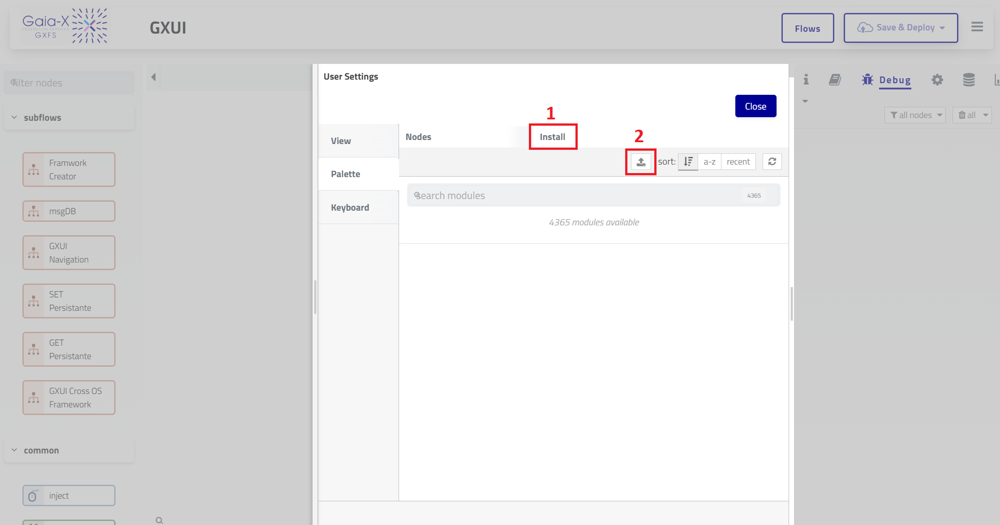

**D.2.4.** Navigate to the `package` directory in the repository, where you will find the `.tgz` file the node you want to install.

**D.2.5.** Once the .tgz file is uploaded, click the "Upload" button to begin the installation process.

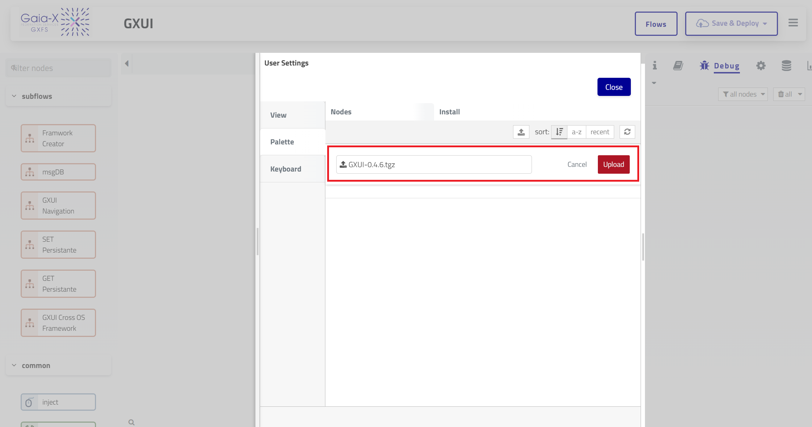

After the installation is complete, the new node should appear in the palette, and you can start using it

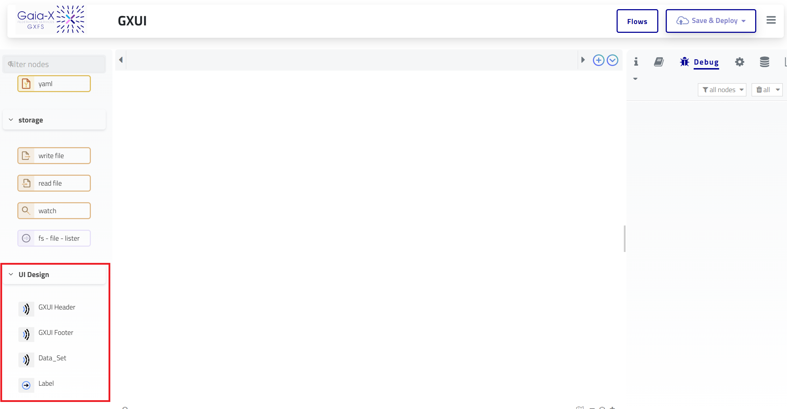

## E. Create .tgz File

To create a .tgz file of the project for use with Node-RED, follow these steps:

**E.1 Step One** : Navigate to the src Directory
Open your terminal or command prompt and navigate to the src directory within the project folder.

using the following command:

      cd src

**E.2 Step Two**: Install npm-pack-all
If you haven't already, install the npm-pack-all package globally 

using the following command:

       npm install -g npm-pack-all

This package allows you to create a .tgz file that includes all necessary files for your project.

**E.3 Step Three** : Create the .tgz File

Run the following command within the src directory to create a .tgz file:

     npm-pack-all

After running this command, you should see a .tgz file created in the src directory.

You can now use this .tgz file to install your Node-RED node using the Node-RED Manage Palette method described in the Project Installation Guide.

## F. Customizing the GXUI Header Node

**F.1 Create header** :
Drag and drop the GXUI Header nodes onto the workspace, including:

**F.2 Name Your Node** :
Choose a name for your custom node. For example, you can use "Header Example" as the name.

**F.3 Customize the Header** :
Click on the "GXUI Header" node to customize it.

   Add menu items: You can add menu items with your preferred name, style, and class.
   Choose the menu item type: Select between "Submit," "Direct Link," and "Submit & Save Data." For example, if you choose "Direct Link," the value you provide will be set as the href attribute of the menu item.

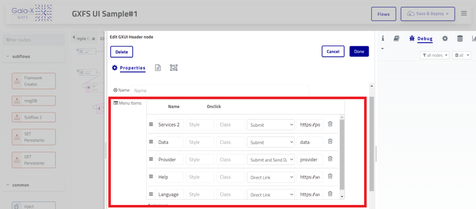

**F.4 Add Menu Buttons** :
Add menu buttons, such as "Sign In" and "Login," by clicking on "Add Element" and creating the buttons.

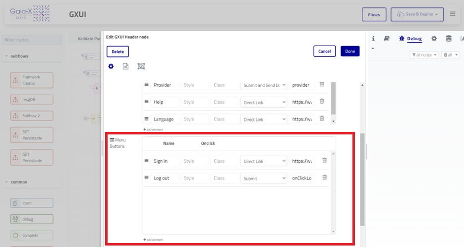

**F.5 Include a Logo and custom classes and styles** :
Add an image to your header as a logo with an alternative text (alt) attribute.You can apply custom classes and styles to the nodes to further tailor the appearance of your form.

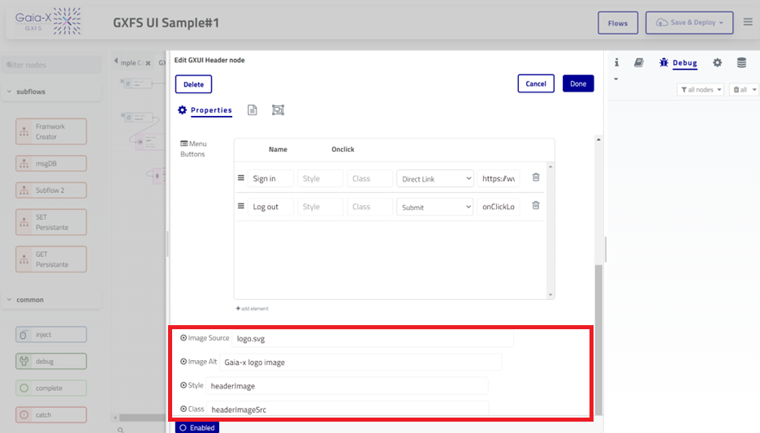
 
The following image displays the outcomes of GXUI header.

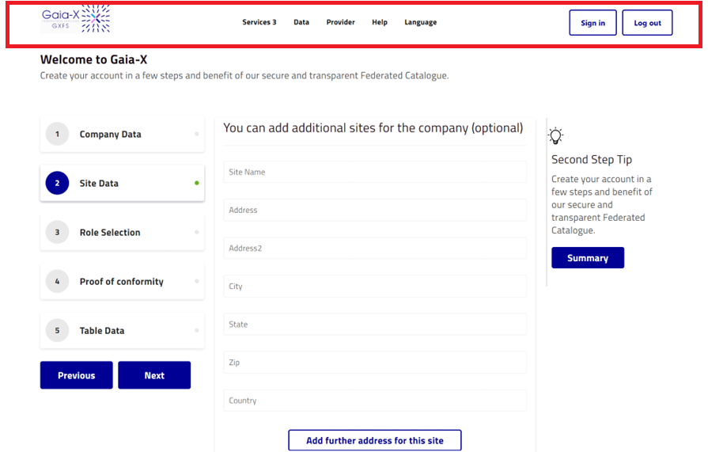

## G. Customizing the GXUI Footer Node

To create a tailored form footer using the GXUI custom nodes, follow the steps below:

**G.1 Drag and Drop** : Drag and drop the "GXUI Footer" node onto your workspace.

**G.2 Name Your Node** : Choose a name for your footer node. This will help you identify it in your project.

**G.3 Add Footer Items** : Customize your footer by adding items with your preferred name, style, and class. You can also choose between "Submit," "Direct Link," and "Submit & Save Data" for each item. For example, if you select "Direct Link," the value you provide will be set as the href attribute for that footer item.

**G.4 Add Menu Buttons** : Enhance your footer with menu buttons by clicking on "Add Element" and creating the buttons.

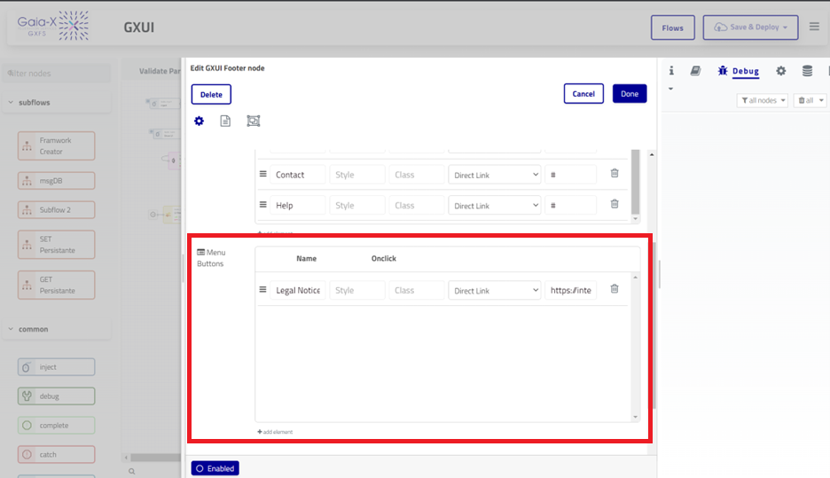
 
**G.5 Include a Logo and custom classes and styles** : Add an image to your header as a logo with an alternative text (alt) attribute.
You can apply custom classes and styles to the nodes to further tailor the appearance of your form.

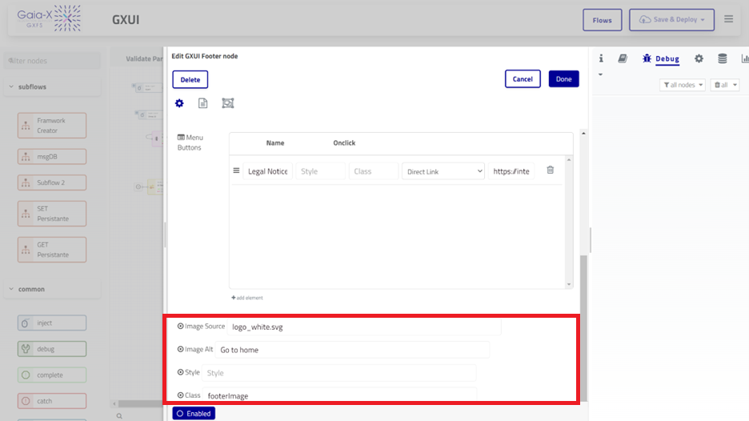

By following these steps, you'll have a customized footer that complements your form and provides additional functionality or information for users.

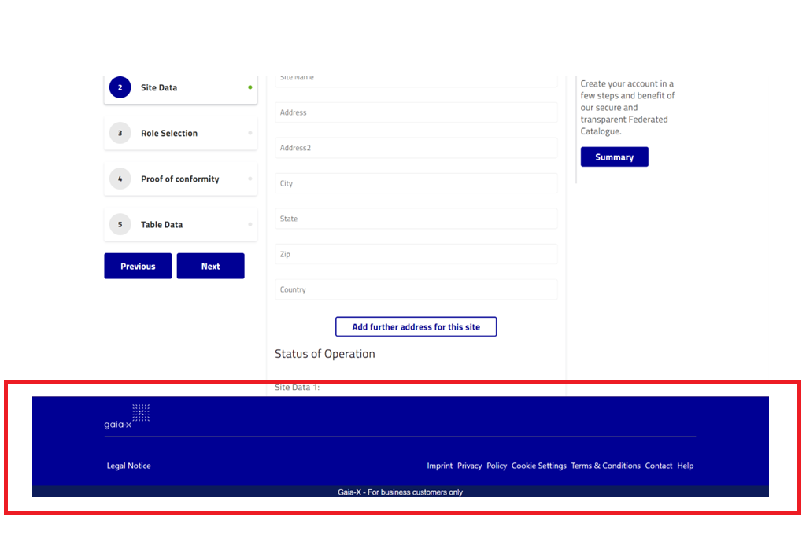

## H. Creating the Form Body with Data Set Nodes

The Data Set node is essential for constructing the full body of your form. Follow these steps to create a comprehensive and customizable form body:

Creating the Form Body with Data Set Nodes
The Data Set node is essential for constructing the full body of your form, and you can use multiple Data Set nodes to create a multi-step form. Follow these steps to create a comprehensive and customizable form body with multiple steps:

- For each step in your form, add a Data Set node by dragging and dropping it onto your workspace.
- Configure each Data Set node with the desired form elements and settings for that specific step.
- After you have configured all the Data Set nodes for each step, click the "Deploy" button to save and deploy your multi-step form.

For example, if you want to create a 3-step form, you should add and configure 3 Data Set nodes:

- Drag and drop 3 Data Set nodes onto your workspace.
- Configure each Data Set node with the appropriate form elements and settings for each step in the  process and then click on deploy button.
- Once you have set up all the steps, click the "Deploy" button to save and deploy your multi-step form.

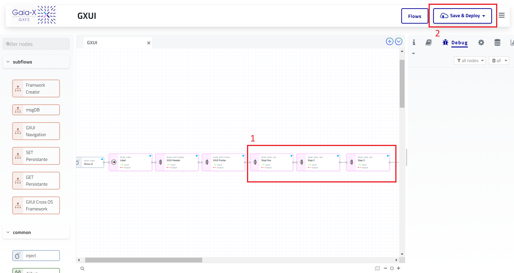

By using multiple Data Set nodes, you can create a form with multiple steps, allowing users to fill out information or make selections in a more organized and guided manner. Each Data Set node represents a separate step in the form, and you can customize the elements and settings of each step according to your requirements.

In the following section, we will provide a detailed, step-by-step guide on configuring Data Set nodes:

**H.1 Drag and Drop** : Drag and drop the Data Set node from the side palette onto your workspace.

**H.2 Configuring Badges** : Set Badge: Configure the badges for your form by providing a number, title, and description in the "Set Badge" section. You can also choose the status of the badge (enabled or disabled).

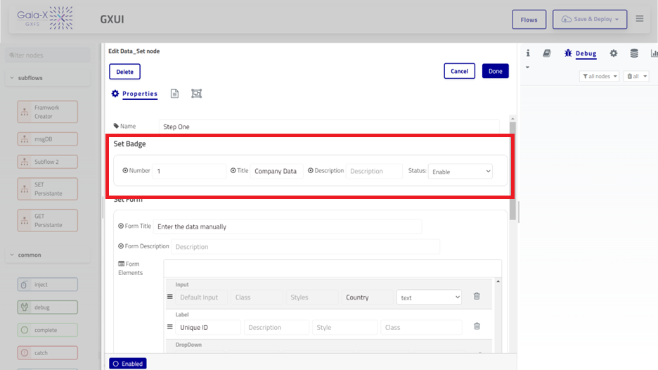

**H.3 Building the Form Body** : Add Elements: Design the body of your form by adding elements such as input fields, labels, radio buttons, switch buttons, date pickers, buttons, checkboxes, upload buttons, and download buttons. You can add a title and description for your form as well.

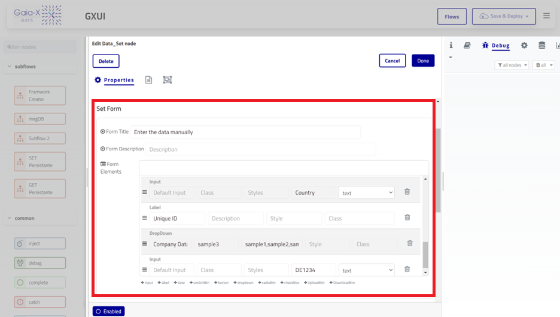

 **H.4 Add Next and Previous Buttons** : If your form has multiple steps, you can add "Next" and "Previous" buttons to help users navigate between sections.

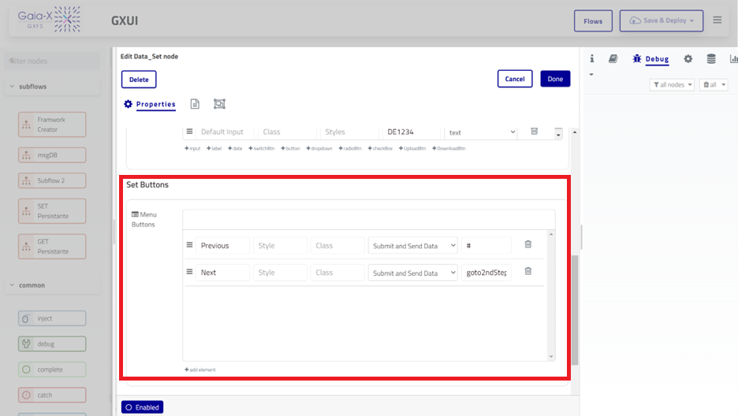

 **H.5 Setting Form Tips** : Add Form Tips: Provide helpful tips for users by adding a title and description for each tip.

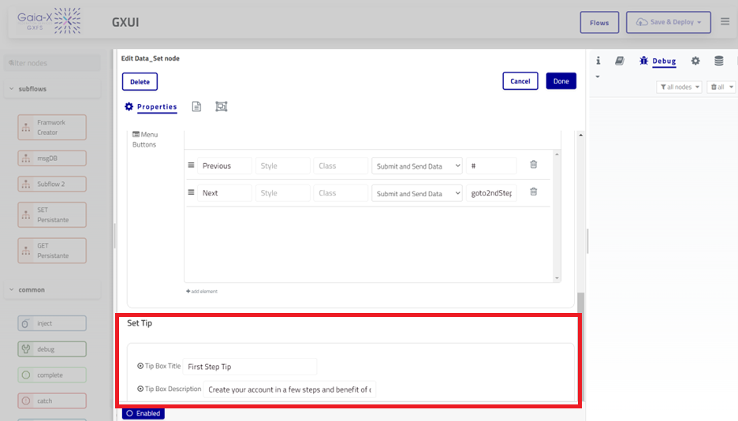

By following these instructions, you can create a fully functional form body with customizable elements, navigation buttons, and informative tips for your users.

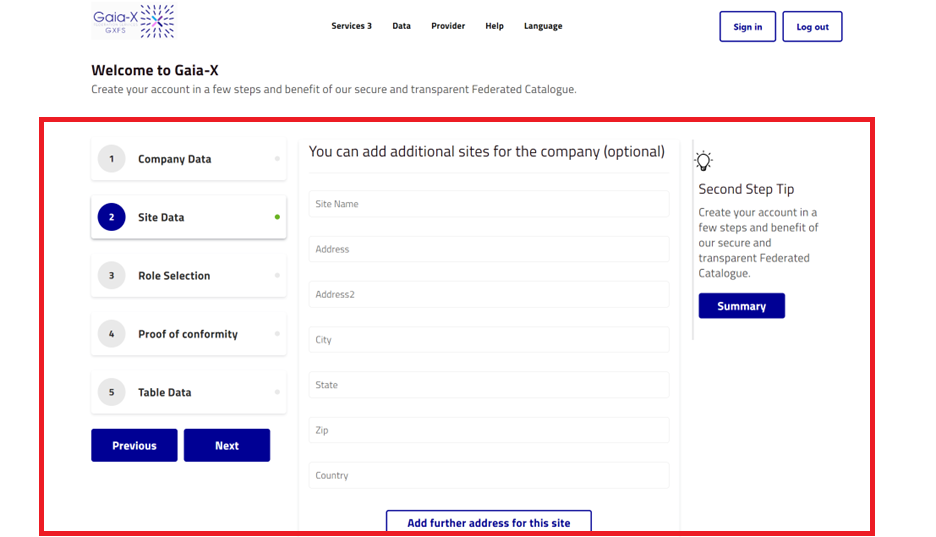

## I. Adding Title and Description with Label Node

To include a title and description for your form, follow these simple steps:

**I.1 Drag and Drop** : Select the Label node from the side palette and drag it onto your workspace.

**I.2 Customize** : Click on the Label node to open its properties. Enter the desired title and description for your form in the respective fields.

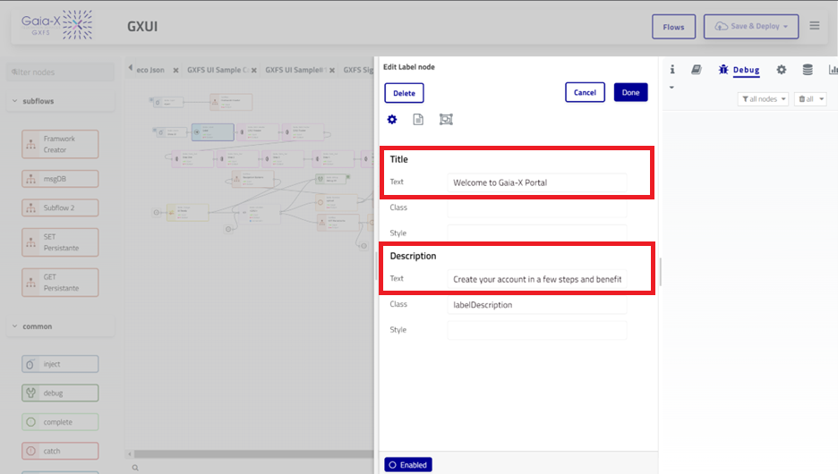

**I.3 Custom Class and Style** : Apply custom classes and styles to the Label node by entering them in the appropriate fields, allowing you to tailor the appearance of your title and description.
 
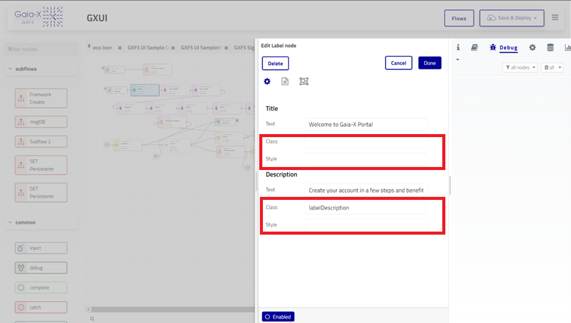

By following these steps, you can create a clear and visually appealing title and description for your form, helping users understand its purpose and content.
 
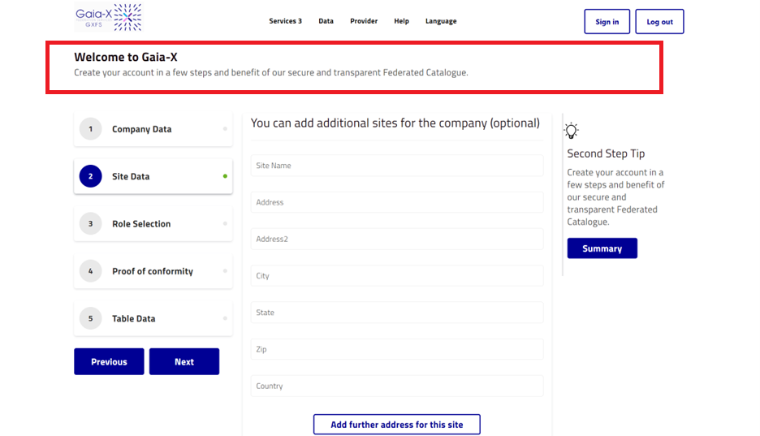

When creating forms using GXUI nodes in GitLab, a JSON structure is generated to represent the various components and their values. The structure is organized as follows:

- The **label** object contains the values set for the title and description of the form.
- The **menu** object holds the values for the footer and header components.
- The **dataset_s** object encompasses the values and configurations of each Data Set node used in the form.

Refer to the image below for a visual representation of the JSON structure generated by a form created using GXUI nodes:

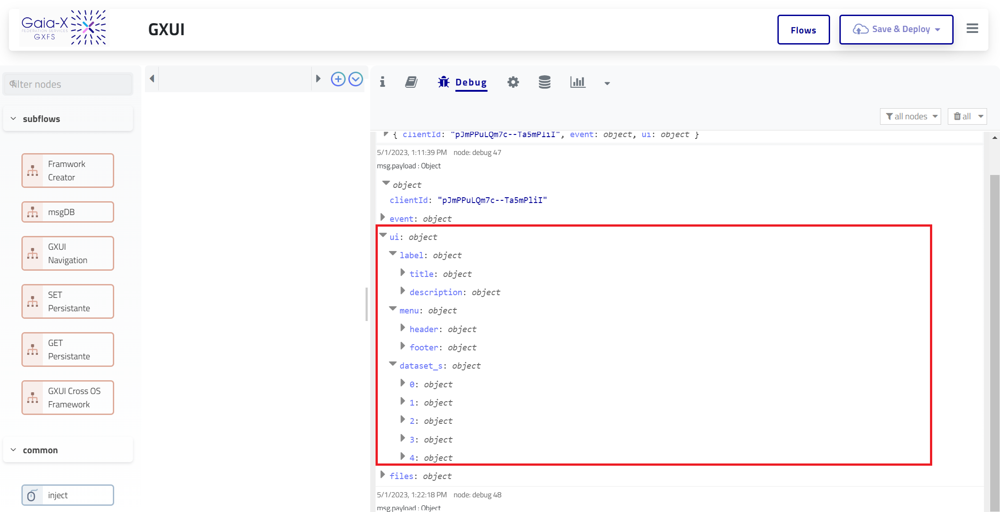

## J. Conclusion
By following this step-by-step guide, you've successfully created a custom form using the GXUI nodes in GitLab. You can now design and customize your forms by dragging and dropping UI nodes and using the various customization options available. Happy form building!
