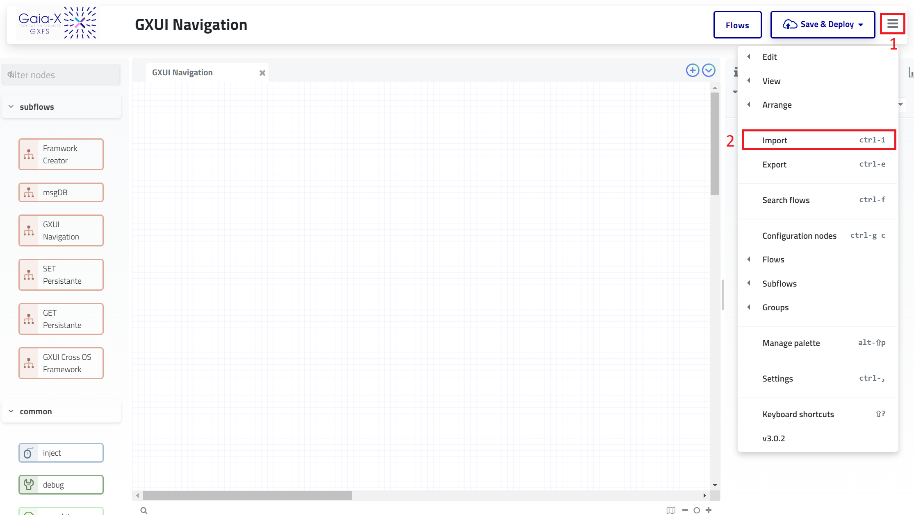
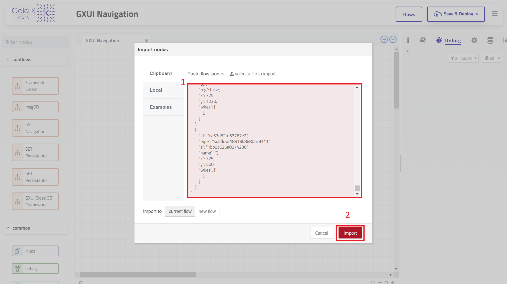

# GXUI Navigation

# Introduction
Welcome to the GXUI Navigation node for Node-RED! This node simplifies the process of adding "Next" and "Previous" buttons to your forms within the GXUI framework. With these navigation buttons, users can easily navigate through the various steps of the GXUI framework, enhancing the overall user experience.

# Prerequisites

**Step One** :
Install and run the Gaia-X Orchestration Engine by following the instructions in the linked repository.

# Usage 
To get started with the GXUI Navigation node, follow these steps:

1. In Node-RED, go to the settings menu and choose "Import."

2. Import the JSON file for the subflow and save it.

